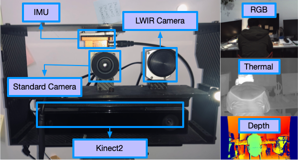

#  Multi-Spectral Dataset

## Abstract

The multi-spectral dataset is provided for evaluating multi-spectral motion estimation methods. The dataset includes sequences in diverse illumination conditions obtained on a setup consisting of a standard camera, an LWIR camera, and a Kinect2. These sensors provide color, thermal, and depth images and the ground-truth trajectory in the dataset. 

* The color and thermal images (640 x 480) are captured at 32Hz on hardware-synchronized devices.
* The depth images are provided by the Kinect2 camera at 30Hz, enabling stereo association between different modality.
* The ground-truth poses are recorded from a motion capture system at 120Hz. 

All sensors are calibrated carefully for higher accuracy.

## Download

Data: [click here](data.md)

Calibration: [click here](calibration.md)

## Tools

### Evaluation Tool

The MATLAB and python tools ([Github Page](https://github.com/weichnn/Evaluation_Tools)) for visual odometry or SLAM works.

### Bag extractor

A simple example ([Github Page](https://github.com/weichnn/bag_extractor)) of how to extract multi-spectal data from bags and how to genarate dense depth images on the standard camera's viewpoint.

## Mission

Visual-based navigation(VN) systems are one of the most fundamental capabilities necessary for autonomous systems. Due to the ubiquitous availability of images, VN systems have become an important component of many autonomous systems. Impressive progress has been made with both geometric-based methods and learning-based methods for standard cameras. However,  in scenarios such as data center inspection, firefighting, and rescue, developing robust and reliable VN systems for real-world applications is still challenging because standard cameras cannot provide sufficient information due to inadequate color textures, smog cover, or dim illumination. Therefore, adding long-wave infrared (LWIR) cameras can complement the texture with information irrelevant to illumination is a good solution. To evaluate the performance of various multi-spectral SLAM and odometry methods involving multi-spectral sources, a complete dataset with ground truth is necessary.
Compared with current popular datasets for stereo standard cameras, such as KITTI, TUM datasets, and EuRoC MAV, the availability of a hardware-synchronized multi-spectral dataset is minimal.
We collect a large dataset using a hardware-synchronized multi-spectral device, Kinect2, Xsens IMU, and a motion capture system. Our dataset's special goal is to focus on the data association between different modalities [[Learn more](ms.md)]. State-of-the-art VN systems struggle to estimate the camera ego-motion in our dataset and get lost on most challenging sequences. Besides, we develop an automatic depth filling pipeline, which allows us to get static stereo references.

The three most important features of our dataset are:

* hardware-synchronized visible and thermal images
* Diverse sequences for debugging
* Challenging Scenes with multiple types of modalities

## Dataset features

### hardware-synchronized multi-spectral images

The multi-spectral device consists of a standard camera and an LWIR camera. The former is an ImageSource DFK 22BUC03. It uses a global shutter and captures 640×480 RGB images at 32 Hz. The LWIR camera is an Optris PI 640, which produces 16-bit 640×480 thermal images and outputs a frame-sync trigger signal at 32Hz. This frame-sync trigger signal is set as the external trigger signal via a hardware connection between both cameras. Therefore, this platform can provide synchronized color and thermal images at 32Hz. The exposure time is set to the value less than the sensor synchronization period, which ensures that the captured images are at the same frequency.

### Scenes

We have recorded multiple sequences using the handheld device data in-/outdoor environments. These environments provide us a wide range of scenarios with different illumination conditions. 

The scenes consist of

* Indoor
    * office room
    * Stairs
    * Hall
    * Elevator
* Outdoor
    * Road
    * Building

### Different illumination conditions

Novel methods can be evaluated in environments with different illumination conditions. In addition to the sequences recorded in bright environments, the sequences name with varying, dim, and even complex illumination conditions are recorded. 

<!-- ### Data process pipeline -->

## Contact

Email us if you have any questions about the dataset. You can also create issues on the associated repositories.

Yu Zhang - (zhangyu80 [at] zju [dot] edu [dot] cn)

Weichen Dai - (Weichendai [at] hotmail [dot] com)

