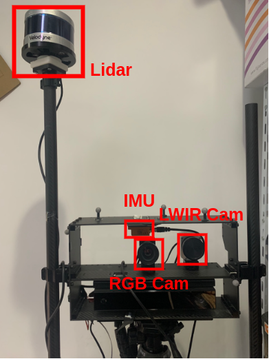
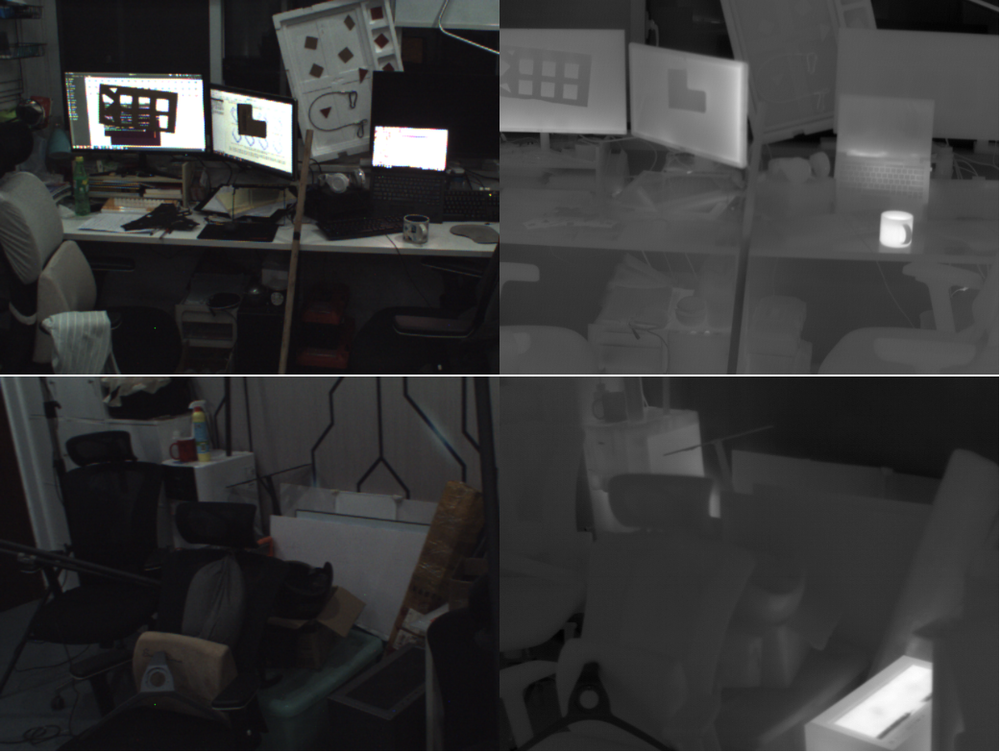
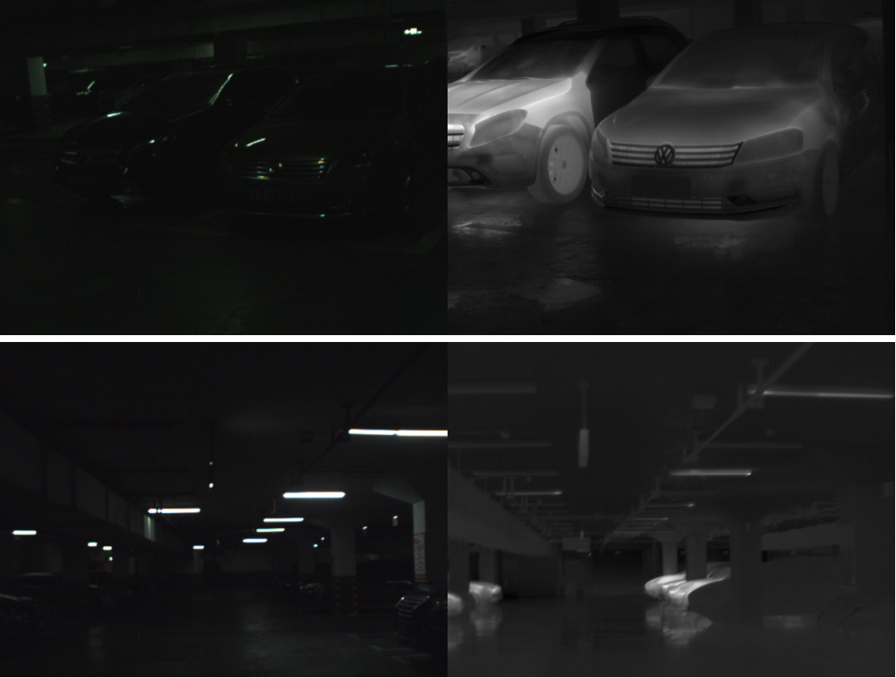
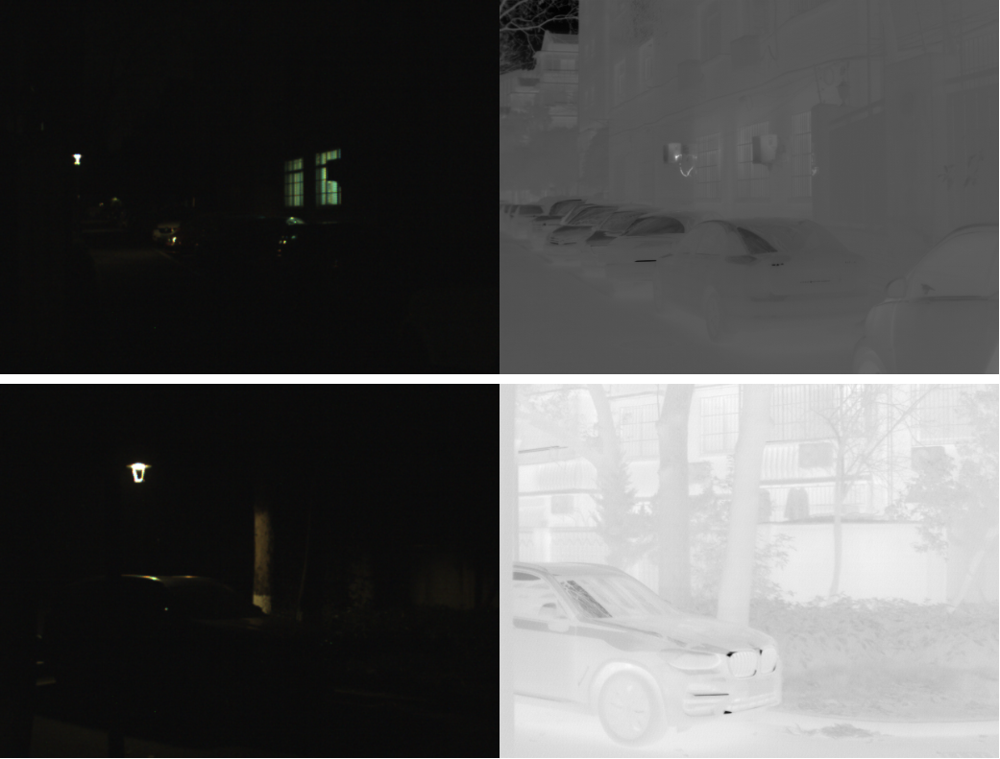

# Thermal Inertial SLAM Experiment data

# Sensor Setup

## Platform

The experiment data is collected by hand-held equipment.

## Senor Parameters

All the sensors and track devices and their most important parameters are listed as below:

- **Lidar**  Velodyne VLP-16
- **RGB Camera** ImageSource DFK 22BUC03. Global shutter. 640x480. 32Hz
- **LWIR Camera** Optris PI 640. 640×480. 32Hz
- **IMU** Xsens MTi-G-710 GNSS/INS

The rostopics of our rosbag sequences are listed as follows:

- **RGB Camera**: `/camera/image_raw`
- **LWIR Camera**: `/optris/thermal_image`
- **IMU**: `/imu/data`
- **OptiTrack**: `/vrpn_client_node/threebody/pose`
- **Lidar**: `/velodyne_points`

# Sequences

## Lab (Indoor)

Lab sequences are captured in a office room.

| Location |   Sequence   | Illumination | Length(m) | Duration(s) |     GT    | Size(GB) | BaiduPan Link |
|:--------:|:------------:|:------------:|:---------:|:-----------:|:---------:|:--------:|:----:|
|    Lab   |     xyz1     |     dark     |   12.989  |     49.1    | OptiTrack |    2.2   |  [Link](https://pan.baidu.com/s/1q3ilZBtaIemymFGFfgP2ow?pwd=9ggr) 提取码：9ggr  |
|    Lab   |     xyz2     |    varying   |   11.917  |     39.1    | OptiTrack |    1.7   |      |
|    Lab   |     xyz3     |    varying   |   12.438  |     38.7    | OptiTrack |    1.4   |      |
|    Lab   |     xyz4*    |    bright    |   13.024  |      59     | OptiTrack |    2.6   |      |
|    Lab   |     xyz5*    |    varying   |   11.109  |     45.2    | OptiTrack |    2.1   |      |
|    Lab   |     xyz6*    |     dark     |   13.656  |     51.9    | OptiTrack |    2.3   |      |
|    Lab   |  halfsphere1 |     dark     |   13.749  |      63     | OptiTrack |    2.8   |      |
|    Lab   |  halfsphere2 |    bright    |   14.013  |      62     | OptiTrack |    2.8   |      |
|    Lab   |  halfsphere3 |    bright    |   9.488   |     36.3    | OptiTrack |    1.4   |      |
|    Lab   | halfsphere4* |    bright    |   10.011  |     47.8    | OptiTrack |    2.1   |      |
|    Lab   | halfsphere5* |    varying   |   10.217  |     48.9    | OptiTrack |    2.1   |      |
|    Lab   | halfsphere6* |     dark     |   14.597  |      63     | OptiTrack |    2.8   |      |
|    Lab   |    circle1   |    bright    |   13.832  |      75     | OptiTrack |    3.3   |      |
|    Lab   |    circle2   |    bright    |   14.897  |     51.9    | OptiTrack |    2.1   |      |
|    Lab   |   circle4*   |    bright    |   14.036  |     49.1    | OptiTrack |    2.2   |      |
|    Lab   |   circle5*   |    varying   |   23.841  |      62     | OptiTrack |    2.5   |      |
|    Lab   |   circle6*   |     dark     |   14.141  |     45.4    | OptiTrack |    2.0   |      |
|    Lab   |   circleN1   |    bright    |   35.856  |     118     | OptiTrack |    5.2   |      |
|    Lab   |   circleN2   |     dark     |   46.173  |      86     | OptiTrack |    2.7   |      |
|    Lab   |   circleN3   |    varying   |   23.841  |      62     | OptiTrack |    2.5   |      |

**Notice**: Sequences with `*` are illumination data in the paper.

## Parking-lot (Indoor)

parking lot sequences are captured in a underground parking lot.
The illumination condition is mainly dark and dim.

|   Location  | Sequence | Length(m) | Duration(s) |  GT  | Size(GB) | Link |
|:-----------:|:--------:|:---------:|:-----------:|:----:|:--------:|:----:|
| Parking_lot | parklot1 |  127.135  |     132     | LOAM |    6.8   |      |
| Parking_lot | parklot2 |  126.318  |     132     | LOAM |    6.6   |      |
| Parking_lot | parklot3 |   94.286  |     108     | LOAM |    5.2   |      |
| Parking_lot | parklot4 |  181.708  |     170     | LOAM |    8.7   |      |
| Parking_lot | parklot5 |  352.303  |     305     | LOAM |   15.5   |      |

## Residential Area (Outdoor)

Outdoor sequences are captured in residential area at NIGHT. The illumination condition is quite bad for visible camera.

|     Location     |   Sequence   | Length(m) | Duration(s) |  GT  | Size(GB) | Link |
|:----------------:|:------------:|:---------:|:-----------:|:----:|:--------:|:----:|
| Residential Area | residential1 |  363.338  |     292     | LOAM |   14.9   |      |
| Residential Area | residential2 |  184.873  |     175     | LOAM |    8.9   |      |
| Residential Area | residential3 |  190.852  |     168     | LOAM |    8.6   |      |

# Calibration

The calibration files are stored in `calibration` folder.
