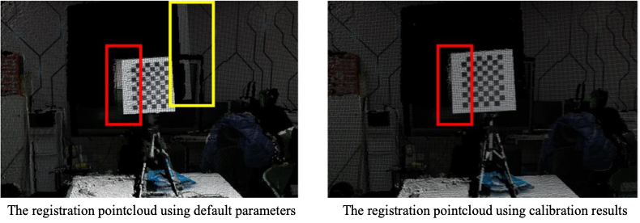
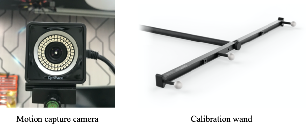

## Calibration Data

[Download link（Synology）](http://gofile.me/3REyI/kUsHfzy4h)

[Download link（Baidu Pan）](https://pan.baidu.com/s/1DSh0r_CxN8FoRVxf-V5uUg)(pyue)

## Calibration files

[Download link（Synology）](http://gofile.me/3REyI/GfYCexfS3)

[Download link（Baidu Pan）](https://pan.baidu.com/s/1t1ViINDmI8Mv3KVICzXNRQ)(r8vq)

## Multi-spectral calibration board

A unique chessboard with the surface made of different materials can provide distinctive textures in both spectra.

## Chessboard for Kinect2 calibration

The board provides distinctive squares for both cameras. Because of the active light, a huge contrast between the board and the background is presented in the NIR image.

### Registration results of Kinect2

The yellow box shows the area with wrong depth values. The area in the red box is the edge of the object, which has more significant uncertainty for Kinect2 since the depth changes a lot. Under uncalibrated parameters, the yellow and red boxes show a wrong texture mapping. After calibration, the color and depth data of the object edges are well matched.

## Motion capture system from OptiTrack

There are four motion capture cameras to track the 3D position of passive reflective markers. The system requires calibration using the wand.

