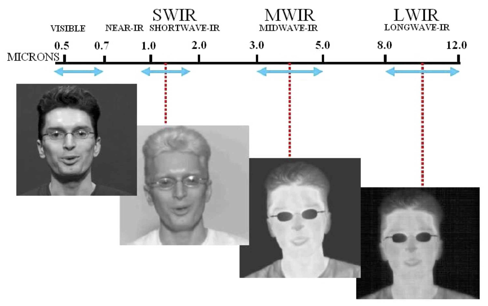
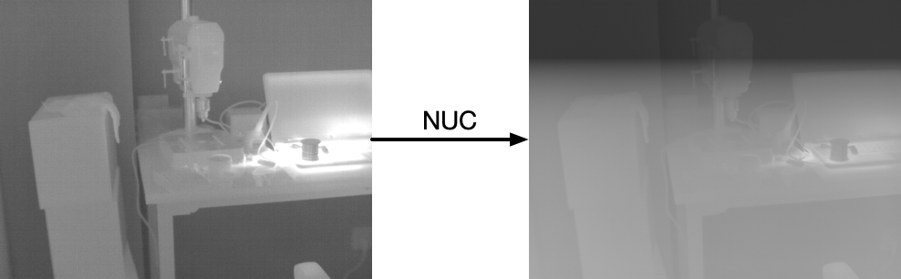
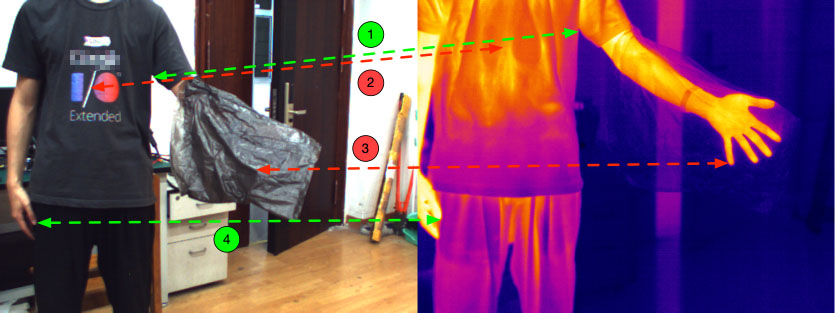

# Challenge in multi-spectral navigation systems

The infrared spectrum can be subdivided into five regions, Near Infrared (NIR), Short Wave Infrared (SWIR), Medium Wavelength Infrared (MWIR), and Long Wavelength Infrared (LWIR), and Very Long Wavelength Infrared (VLWIR). The Long Wavelength Infrared (LWIR) bands can provide Infrared Thermography information with near room temperature. 

There is fixed noise in the thermal image due to camera self-emission. For this reason, most uncooled LWIR cameras use Non-Uniformity Correction (NUC) to eliminate the fixed noise. For every ten seconds LWIR cameras need about half second to do NUC, during which the images are corrupted and hence unavailable as shown in the figure. 

In addition, due to the difference in information sources, visible and thermal images share a little similar texture. This leads to the situation that two types of stereo correspondences, potential, and unfeasible correspondences, are difficult to deal with using explicit stereo matching. The figure shows some examples of potential and unfeasible correspondences depicted by the green and red dashed lines, respectively. 

Existing explicit stereo matching can only extract potential correspondences associated with similar texture from the two images. As a result, even though each image contains rich textures, the VO methods based on stereo matching cannot yield robust estimation if only a few potential correspondences exist, and the methods will even fail when there are no potential correspondences. The reliance on shared texture limits their performance and applicability in real-world environments.
